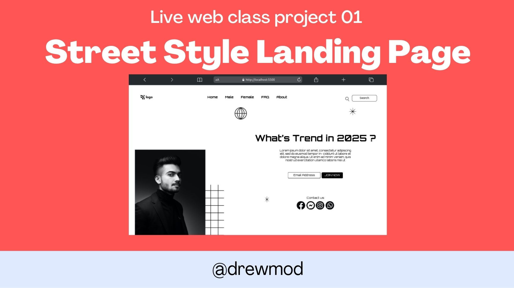

# _I'm Adebola Andrew Modongho_ 

I've been Working on this assigments given to us by mentor [Hitesh Choudhary](https://github.com/hiteshchoudhary)</b> 

## What I have learnt ?

    - HTML 5 tags and elements
    - CSS 3 Selectors
    - CSS 3 Positioning
    - Other CSS3 properties etc.

## Estimated time I took to complete this

    - Five hours

## Learning Program_

currently learning ...<strong>Full Stack Javascript Web Development By [Hitesh Choudhary](https://github.com/hiteshchoudhary)</strong>

## Connect With Me:

 

